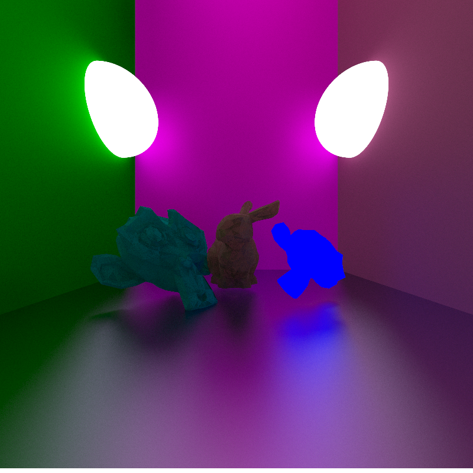
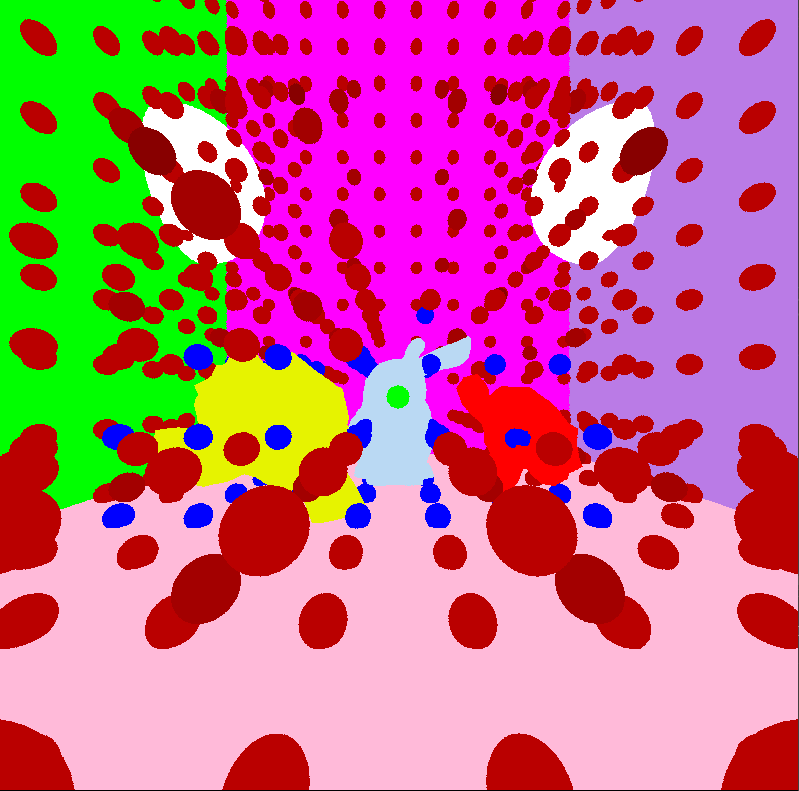
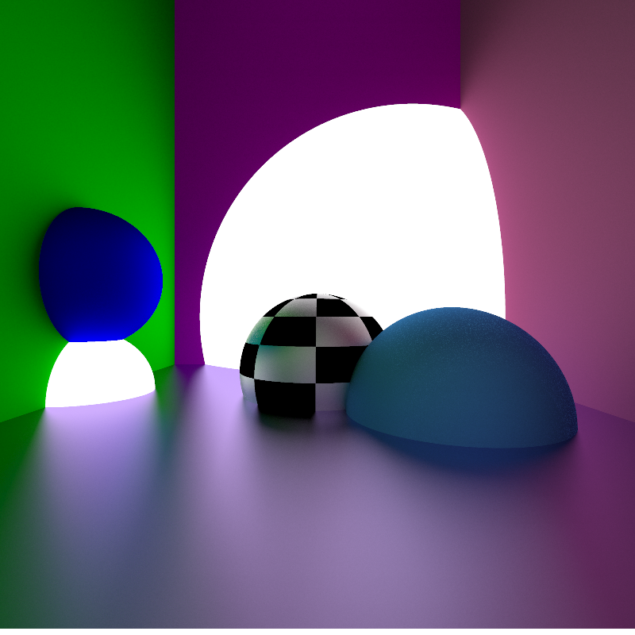
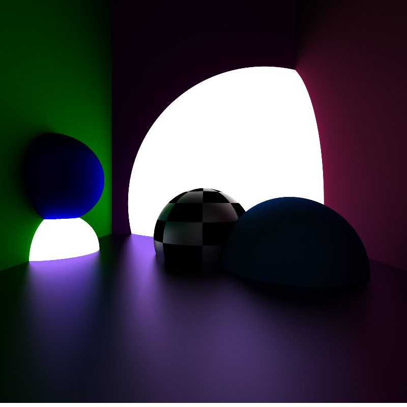

# MostGenericRayTracerInExistance

This is a project I made for fun while revisiting some old projects, although I made a raytracer<br>
in the past, I felt like it could be hugely improved.<br>

This is a basic not optimized, multithreaded Path Tracer.<br>
I also implemented a bounded volume hierarchy for faster ray-triangle intersection<br>

```
TODO:
    - Add support for AVX512 for my Ryzen 9 7900X to crunch
    - Add support for camera movement
    - Make attenuation actually slightly more realistic
```
 <br>

## Some result
Config:
<ul>
    <li> 8 rays per pixel
    <li> 6 ray bounces
    <li> 1000 iterations
</ul>
Works with meshes<br>



Showing the octree nodes using debug spheres:<br>


Result with sRGB<br>



Result without sRGB<br>



This also has a UI mode where you can see the image update in real time:
(The GIF software had some issues with some slight changes in frames, so some artifacts only appear in the GIF)


Created by Streanga Sarmis-Stefan
